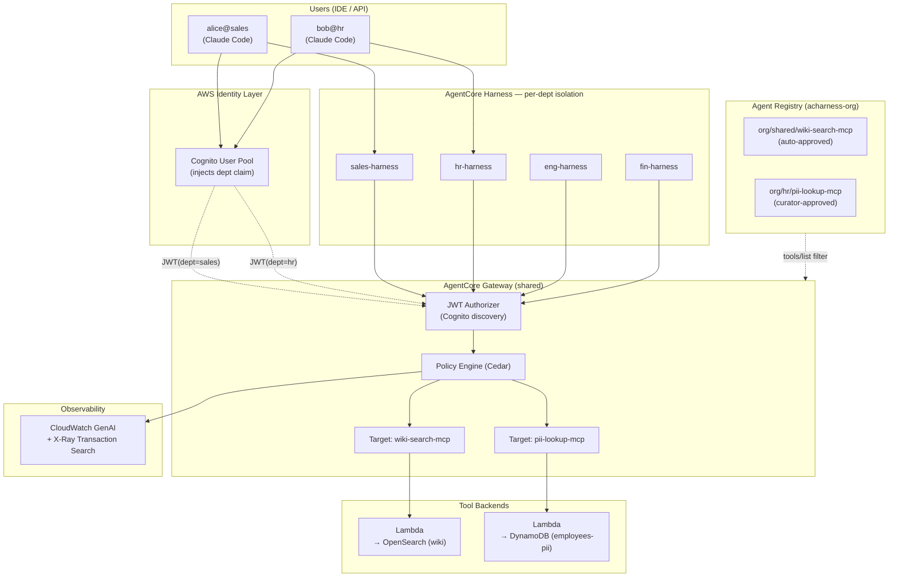

# AC-Harness

Amazon Bedrock **AgentCore Harness** + **Agent Registry** demo — four department-isolated agents sharing one MCP Gateway, with Cedar policy gating PII access at the tool-call layer.

> ⚠️ **DEMO ONLY.** This repo provisions Cognito users with a hardcoded password, opens an OpenSearch Serverless collection to public ingress (auth-gated by SigV4), and uses `removalPolicy: DESTROY` everywhere. Do **not** deploy as-is into any environment that holds real data.

## Why

Enterprises rolling out internal AI agents hit the same wall:

- Each department wires up its own LLM agent, but **there is no central control over who can call which tool**.
- "Search the corporate wiki" should be open to all; "look up an employee PII record" must be HR-only — IAM roles do not reach down to **per-MCP-tool granularity**.
- IDE-based agents (Cursor / Claude Code / Kiro) push tool wiring to **per-user `.mcp.json`** files, opening governance blind spots.
- Security teams need to answer "which user, when, called which tool, and why was it denied?" — and have it auditable.

| Existing approach | Limit |
|---|---|
| IAM Role + Lambda | No per-tool authorization, no central catalog, IDE clients are scattered |
| Self-built MCP proxy | Department isolation, policy engine, audit log all rebuilt from scratch |
| LangChain / Strands raw | Missing the governance layer entirely |

This demo composes **Bedrock AgentCore Harness + Registry + Gateway + Cedar Policy + CloudWatch GenAI Observability** into one platform that covers tool catalog, department isolation, policy enforcement, and audit logging.

## Architecture



Three roles, one platform: **Registry is the catalog, Gateway is the runtime gate, Harness is the per-department isolation boundary.**

## What it builds

7 CDK stacks (us-east-1):

| Stack | What it provisions |
|---|---|
| `AcharnessIdentityStack` | Cognito User Pool, 4 dept groups (hr/sales/eng/fin), 4 seed users (alice/bob/carol/eric), Pre-Token Generation Lambda v2 (injects `dept` claim), 4 dept runtime IAM roles |
| `AcharnessDataStack` | OpenSearch Serverless `wiki-shared` collection (BM25), DynamoDB `employees-pii` table seeded from `data/pii-seed.json` |
| `AcharnessToolsStack` | `wiki-search-fn` + `pii-lookup-fn` Lambdas (MCP tool backends), `wiki-seed-fn` (one-shot index seeder) |
| `AcharnessGatewayStack` | Shared AgentCore Gateway (CUSTOM_JWT, MCP), 2 Lambda targets |
| `AcharnessRegistryStack` | AgentCore Registry `acharness-org`, 2 records (shared/wiki, hr/pii) |
| `AcharnessPolicyStack` | PolicyEngine + Cedar policies (LOG_ONLY): permit pii_lookup when dept=hr, forbid otherwise |
| `AcharnessHarnessStack` | 4 dept Harness instances (no container, default runtime) |

## Prerequisites

- AWS account with permission to deploy CDK
- Node 20+, Python 3.12+, AWS CLI v2, AWS CDK CLI v2 (`npm i -g aws-cdk` or use `npx`)
- AWS profile pointing at the target account/region (us-east-1)
- Internet access during `cdk deploy` — the registry-cr Lambda needs `pip install boto3>=1.43.21` for `bedrock-agentcore-control` (Lambda runtime ships an older boto3)
- (Optional) Docker — only used as fallback when local `pip` can't bundle Lambda deps

## Deploy

```bash
cd cdk
npm install
cdk bootstrap            # if not already bootstrapped
cdk deploy --all         # ~10 minutes end-to-end
```

After deploy completes, generate the local MCP wiring:

```bash
cd ..
./scripts/bootstrap-env.sh
```

This writes:
- `.env.acharness` — `ACHARNESS_CLIENT` (Cognito app client id) + `ACHARNESS_REGION`
- `.mcp.json` — Claude Code MCP server entry pointing at the deployed Gateway URL

Both files are `.gitignore`'d — they hold per-deployment identifiers.

## Use the demo

```bash
# 1. Pick a user (any of: alice/bob/carol/eric)
source scripts/switch-user.sh bob

# 2. In Claude Code (or any MCP client that reads .mcp.json):
#    /mcp -> acharness-gateway -> reconnect
```

The demo password for all seed users is **`AcHarness!Demo2026`** — defined in [`cdk/lib/identity-stack.ts`](cdk/lib/identity-stack.ts) (`POC_TEMP_PASSWORD`). Change it there if you want a different value; redeploy the Identity stack.

### What each user sees

`PolicyStack` ships in `LOG_ONLY` mode by default. Flip to `ENFORCE` (next section) to see real isolation.

| Mode | alice / carol / eric | bob (hr) |
|---|---|---|
| `LOG_ONLY` (default after deploy) | Sees both `wiki_search` and `pii_lookup`. Both calls **succeed**, but a deny span is logged for `pii_lookup`. | Sees both. Both succeed. |
| `ENFORCE` (after toggle) | `pii_lookup` calls return 403. `wiki_search` succeeds. | Sees both. Both succeed. |

### 6-way matrix (under `ENFORCE`)

3 users × 2 tools = 6 cases, all enforced by the same Cedar policy set:

| User | dept claim | wiki_search | pii_lookup | Cedar decision |
|---|---|---|---|---|
| alice | sales | ✅ ALLOW | 🔒 **DENY** | no permit applies (default deny) |
| bob | hr | ✅ ALLOW | ✅ **ALLOW** | `permit(...) when dept == "hr"` matches |
| carol | eng | ✅ ALLOW | 🔒 **DENY** | dept mismatch → deny |

Cedar policies (excerpt — full source in [`cdk/lib/policy-stack.ts`](cdk/lib/policy-stack.ts)):

```cedar
// wiki — open to everyone
permit(principal, action == AgentCore::Action::"wiki-search-mcp___wiki_search", resource);

// pii_lookup — HR only
permit(principal, action == AgentCore::Action::"pii-lookup-mcp___pii_lookup", resource)
  when { principal.hasTag("dept") && principal.getTag("dept") == "hr" };

forbid(principal, action == AgentCore::Action::"pii-lookup-mcp___pii_lookup", resource)
  unless { principal.hasTag("dept") && principal.getTag("dept") == "hr" };
```

### Demo prompts

| Prompt | alice (sales) | bob (hr) |
|---|---|---|
| "How many PTO days, and is carryover allowed?" | answers from wiki | answers from wiki |
| "Look up alice's employee record." | tool not visible (or denied under ENFORCE) | returns ssn_last4 / salary_band / dept |

The mechanism: Gateway's `tools/list` response is filtered by JWT claim, so the IDE user only sees tools they can call. Cedar Policy then guards the actual `tools/call`.

## Toggle Cedar enforcement

```bash
ENGINE_ARN=$(aws cloudformation describe-stacks --stack-name AcharnessPolicyStack \
  --query "Stacks[0].Outputs[?OutputKey=='PolicyEngineArn'].OutputValue" --output text)
GATEWAY_ID=$(aws cloudformation describe-stacks --stack-name AcharnessGatewayStack \
  --query "Stacks[0].Outputs[?OutputKey=='GatewayId'].OutputValue" --output text)

aws bedrock-agentcore-control update-gateway \
  --gateway-identifier "$GATEWAY_ID" \
  --policy-engine-configuration "arn=$ENGINE_ARN,mode=ENFORCE" \
  --region us-east-1
```

After flip, alice's `pii_lookup` calls return 403 instead of executing. Revert by re-running with `mode=LOG_ONLY`.

## Observability — Cedar deny spans

Every authorization decision (allow or deny) emits a span tagged with the Cedar verdict:

```
sequence: alice → Gateway → Policy Engine → CloudWatch
─────────────────────────────────────────────────────────
1. alice calls tools/call pii_lookup  (JWT: dept=sales)
2. Gateway forwards to Cedar engine
3. Cedar evaluates → DENY (no permit matches)
4. Gateway returns AuthorizeActionException to alice
5. Span emitted to CloudWatch with:
     aws.agentcore.policy.authorization_decision = "DENY"
     aws.agentcore.policy.reason                 = "[No policy applies (denied by default).]"
     aws.agentcore.policy.determining_policies   = []
```

Find them in CloudWatch → GenAI Observability → Transaction Search:

```
filter aws.agentcore.policy.authorization_decision = "DENY"
```

This is what answers "who tried what tool, when, and why it failed" — a security team's three-click audit.

## Registry approval workflow

Registry records can be `autoApproval=true` (immediately visible) or `autoApproval=false` (curator must approve before Gateway exposes them).

```
DRAFT → SubmitForApproval → PENDING_APPROVAL → APPROVED → visible in tools/list
                                              → REJECTED → hidden from catalog
```

Live commands (the demo creates `wiki-search-mcp` auto-approved and `pii-lookup-mcp` pending):

```bash
REGISTRY=$(aws cloudformation describe-stacks --stack-name AcharnessRegistryStack \
  --query "Stacks[0].Outputs[?OutputKey=='RegistryArn'].OutputValue" --output text)

# Approve the HR record
aws bedrock-agentcore-control submit-registry-record-for-approval \
  --registry-id "$REGISTRY" --record-id <pii-record-id> --region us-east-1

aws bedrock-agentcore-control update-registry-record-status \
  --registry-id "$REGISTRY" --record-id <pii-record-id> --status APPROVED \
  --status-reason "Reviewed by security team"

# Or reject
aws bedrock-agentcore-control update-registry-record-status \
  --registry-id "$REGISTRY" --record-id <pii-record-id> --status REJECTED \
  --status-reason "Requires DPO review"
```

Effect: a namespace with `autoApproval=false` cannot reach Gateway `tools/list` without a curator action. Registry doubles as a tool catalog **and** an approval gate.

## Tear down

```bash
cd cdk
cdk destroy --all
```

DynamoDB and OpenSearch collections are configured `RemovalPolicy.DESTROY` — cleanup is total.

## Gotchas (from building this)

If you fork and extend, these are the traps that cost the most time the first time around:

- **Cedar two-phase deploy** — Gateway must exist (with its ARN) before the PolicyEngine is attached. CDK dependency: `PolicyStack.addDependency(GatewayStack)`.
- **`validationMode: 'IGNORE_ALL_FINDINGS'`** required when permitting broad action entities — AgentCore Cedar is default-deny and complains otherwise.
- **Gateway TRACES delivery** accepts only `XRAY` type (CloudWatch Logs is rejected).
- **`update-gateway` is full-replace, not partial** — re-send every field you want to keep.
- **Cognito id-token, not access-token** — Gateway's CUSTOM_JWT authorizer checks the `aud` claim, which only the id-token has.
- **VS Code extensions inherit the parent shell's env** — switching demo users requires `code .` from a fresh shell after `source scripts/switch-user.sh <name>`.
- **registry-cr Lambda needs boto3 ≥ 1.43.21** — Lambda's bundled boto3 (~1.40) does not include `bedrock-agentcore-control`. The CDK bundles a newer pip install at synth time.
- **Pre-Token Generation Lambda v2** — only v2 can mutate the access-token claim set. v1 silently fails to inject `dept`. CDK escape-hatch in `IdentityStack` forces `LambdaVersion: V2_0`.

## Known limitations / PoC trade-offs

- **AgentCore is in Public Preview** — control-plane calls go through `AwsCustomResource` with `bedrock-agentcore:* Resource:'*'` in many places because ARN-based conditions are not consistently supported yet.
- **OpenSearch collection is public-network** (`AllowFromPublic: true`). Auth-gated by SigV4. Production should swap to a VPC endpoint policy.
- **Cognito app client allows `USER_PASSWORD_AUTH`** so the helper script can mint tokens via plain `initiate-auth`. Production should be SRP-only.
- **Removal policy is DESTROY** for DynamoDB and OpenSearch. Convenient for demos, dangerous for real data.
- **PII seed data** in [`data/pii-seed.json`](data/pii-seed.json) is synthetic. The SSN-last-4 values are random and the email domains are `*.acharness.demo` (RFC 2606-style reserved).

## Repository layout

```
agents/dept-agent/      Strands agent (one shape, four deployments).
                        Dockerfile + server.py are an unused container-runtime
                        reference — see file headers for activation steps.
cdk/                    7 stacks
data/                   pii-seed.json + wiki-seed/*.md
lambdas/                wiki-search, pii-lookup, wiki-seed, registry-cr, pre-token-gen
scripts/                bootstrap-env.sh, get-mcp-token.sh, switch-user.sh
```

## License

MIT — see [LICENSE](LICENSE).
